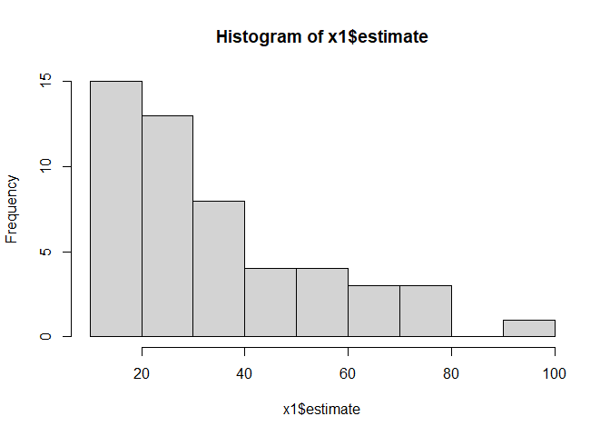

<!-- README.md is generated from README.Rmd. Please edit that file -->

<!-- You'll still need to render `README.Rmd` regularly, to keep `README.md` up-to-date. `devtools::build_readme()` is handy for this.  -->

# Insert Package Name

<!-- badges: start -->

<!-- badges: end -->

The goal of `gregRy` is to make the GREGORY estimator easily available
to use.

## Installation

The development version of `gregRy` is available from
[GitHub](https://github.com/) with:

``` r
# install.packages("devtools")
devtools::install_github("olekwojcik/gregRy")
```

## Example Computations

The package `gregRy` does not contain a dataset, which is why our
example utilizes the package
[pdxTrees](https://github.com/mcconvil/pdxTrees)

### GREGORY

``` r
library(gregRy)
#load and wrangle data

# Overall dataset to create estimates with
# Includes response variable and predictors

dat <- get_pdxTrees_parks() %>%
  as.data.frame() %>%
  drop_na(DBH, Crown_Width_NS, Tree_Height) %>%
  filter(Condition != "Dead") %>%
  select(UserID, Tree_Height, Crown_Width_NS, DBH, Condition, Family)

dat_est <- dat %>%
  filter(Family == "Pinaceae")
predictors <- c("Crown_Width_NS", "DBH")

dat_x_bar <- dat %>%
  dplyr::group_by(Family) %>%
  dplyr::summarize(dplyr::across(predictors,
                                mean)) %>%
  tidyr::pivot_longer(!Family,
                            names_to = "variable",
                            values_to = "mean")
dat_count_est <- dat %>%
  group_by(Family) %>%
  summarize(count = n())

# Create dataset of proportions using estimation and resolution

dat_prop <- left_join(dat, dat_count_est, by = "Family") %>%
  group_by(Condition, Family) %>%
  summarize(prop = n()/count) %>%
  distinct() %>%
  ungroup()

# Create dataset of means of 'pixel' data

dat_x_means <- get_pdxTrees_parks() %>%
  as.data.frame() %>%
  drop_na(DBH, Crown_Width_NS, Tree_Height) %>%
  dplyr::summarize(DBH = mean(DBH), Crown_Width_NS = mean(Crown_Width_NS),
            Tree_Height = mean(Tree_Height))
dat_x_bar_new <- dat_x_bar %>%
  filter(variable == "Crown_Width_NS") %>%
  mutate(Crown_Width_NS = mean) %>%
  select(Family, Crown_Width_NS)
```

``` r
hist(x1$estimate, title = "GREGORY estimates of Tree Height using Crown Width as a Predictor")
#> Warning in plot.window(xlim, ylim, "", ...): "title" is not a graphical
#> parameter
#> Warning in title(main = main, sub = sub, xlab = xlab, ylab = ylab, ...): "title"
#> is not a graphical parameter
#> Warning in axis(1, ...): "title" is not a graphical parameter
#> Warning in axis(2, ...): "title" is not a graphical parameter
```



### GREG
