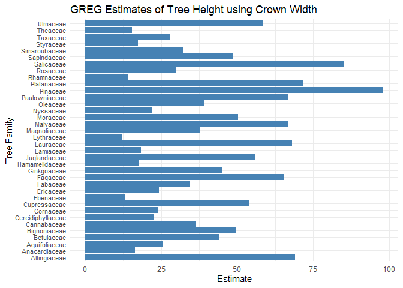

<!-- README.md is generated from README.Rmd. Please edit that file -->

<!-- You'll still need to render `README.Rmd` regularly, to keep `README.md` up-to-date. `devtools::build_readme()` is handy for this.  -->

# gregRy

<!-- badges: start -->

<!-- badges: end -->

The goal of `gregRy` is to make the GREGORY estimator easily available
to use.

## Installation

The development version of `gregRy` is available from
[GitHub](https://github.com/) with:

``` r
# install.packages("devtools")
devtools::install_github("olekwojcik/gregRy")
```

## Example Computations

The package `gregRy` does not contain a dataset, which is why our
example utilizes the package
[pdxTrees](https://github.com/mcconvil/pdxTrees)

### GREGORY

``` r
library(gregRy)
#load and wrangle data

# Overall dataset to create estimates with
# Includes response variable and predictors

dat <- get_pdxTrees_parks() %>%
  as.data.frame() %>%
  drop_na(DBH, Crown_Width_NS, Tree_Height) %>%
  filter(Condition != "Dead") %>%
  select(UserID, Tree_Height, Crown_Width_NS, DBH, Condition, Family)

dat_est <- dat %>%
  filter(Family == "Pinaceae")
predictors <- c("Crown_Width_NS", "DBH")

dat_x_bar <- dat %>%
  dplyr::group_by(Family) %>%
  dplyr::summarize(dplyr::across(predictors,
                                mean)) %>%
  tidyr::pivot_longer(!Family,
                            names_to = "variable",
                            values_to = "mean")
dat_count_est <- dat %>%
  group_by(Family) %>%
  summarize(count = n())

# Create dataset of proportions using estimation and resolution

dat_prop <- left_join(dat, dat_count_est, by = "Family") %>%
  group_by(Condition, Family) %>%
  summarize(prop = n()/count) %>%
  distinct() %>%
  ungroup()

# Create dataset of means of 'pixel' data

dat_x_means <- get_pdxTrees_parks() %>%
  as.data.frame() %>%
  drop_na(DBH, Crown_Width_NS, Tree_Height) %>%
  dplyr::summarize(DBH = mean(DBH), Crown_Width_NS = mean(Crown_Width_NS),
            Tree_Height = mean(Tree_Height))

dat_x_bar_new <- dat_x_bar %>%
  filter(variable == "Crown_Width_NS") %>%
  mutate(Crown_Width_NS = mean) %>%
  select(Family, Crown_Width_NS)
```

To use GREGORY, we need 3 different datasets.

The first dataset is the overall data:

    #>   UserID Tree_Height Crown_Width_NS  DBH Condition   Family
    #> 1      1         105             44 37.4      Fair Pinaceae
    #> 2      2          94             49 32.5      Fair Pinaceae
    #> 3      3          23             28  9.7      Fair Rosaceae
    #> 4      4          28             38 10.3      Poor Fagaceae
    #> 5      5         102             43 33.2      Fair Pinaceae
    #> 6      6          95             35 32.1      Fair Pinaceae

The second dataset is the means of the predictors at the estimation
level (Family estimates):

    #>          Family Crown_Width_NS
    #> 1     Adoxaceae      20.000000
    #> 2  Altingiaceae      40.604444
    #> 3 Anacardiaceae      19.250000
    #> 4 Aquifoliaceae      14.854167
    #> 5    Araliaceae       9.000000
    #> 6     Arecaceae       9.666667

The third dataset is contains both the resolution and estimation, with
the proportion of resolution in the given estimation unit:

    #>   Condition        Family      prop
    #> 1      Fair     Adoxaceae 1.0000000
    #> 2      Fair  Altingiaceae 0.9066667
    #> 3      Fair Anacardiaceae 0.7500000
    #> 4      Fair Aquifoliaceae 0.8750000
    #> 5      Fair    Araliaceae 1.0000000
    #> 6      Fair     Arecaceae 1.0000000

``` r
# Create GREGORY estimates
x1 <- gregory_all(plot_df = dat %>% drop_na(),
            resolution = "Condition",
            estimation = "Family",
            pixel_estimation_means = dat_x_bar_new,
            proportions = dat_prop,
            formula = Tree_Height ~ Crown_Width_NS,
            prop = "prop")
print(x1)
#> # A tibble: 51 x 2
#>    Family         estimate
#>    <chr>             <dbl>
#>  1 Adoxaceae          30  
#>  2 Altingiaceae       67.5
#>  3 Anacardiaceae      19.2
#>  4 Aquifoliaceae      24.5
#>  5 Araliaceae         10  
#>  6 Arecaceae          22  
#>  7 Betulaceae         44.5
#>  8 Bignoniaceae       45.5
#>  9 Cannabaceae        39.4
#> 10 Caprifoliaceae     19  
#> # ... with 41 more rows
```

``` r
ggplot(x1, aes(x=estimate)) + 
  geom_histogram(color="black", fill="white") + 
  xlim("Estimate") + 
  labs(title = "GREGORY Estimates of Tree Height using Crown Width")
```


### GREG

``` r
# Create GREG estimates
x2 <- greg_all(plot_df = dat %>% drop_na(),
         estimation = "Family",
         pixel_estimation_means = dat_x_bar_new,
         formula = Tree_Height ~ Crown_Width_NS)
print(x2)
#> # A tibble: 51 x 2
#>    Family         estimate
#>    <chr>             <dbl>
#>  1 Adoxaceae          30  
#>  2 Altingiaceae       67.5
#>  3 Anacardiaceae      19.2
#>  4 Aquifoliaceae      24.5
#>  5 Araliaceae         10  
#>  6 Arecaceae          22  
#>  7 Betulaceae         44.5
#>  8 Bignoniaceae       45.5
#>  9 Cannabaceae        39.4
#> 10 Caprifoliaceae     19  
#> # ... with 41 more rows
```

``` r
ggplot(x2, aes(x=estimate)) + 
  geom_histogram(color="black", fill="white") + 
  xlim("Estimate") + 
  labs(title = "GREG Estimates of Tree Height using Crown Width")
```


